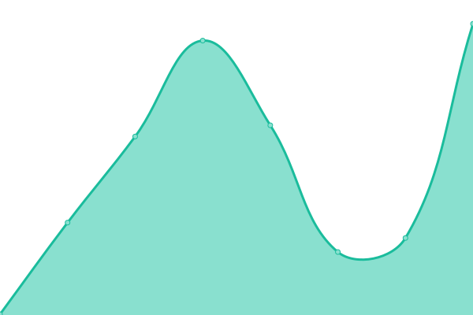

# [📈 Live Status](https://status.arijit-bhowmick.me): <!--live status--> **🟩 All systems operational**

This repository contains the open-source uptime monitor and status page for [Arijit Bhowmick](https://sys41x4.github.io), powered by [Upptime](https://github.com/upptime/upptime).

With [Upptime](https://upptime.js.org), you can get your own unlimited and free uptime monitor and status page, powered entirely by a GitHub repository. We use [Issues](https://github.com/sys41x4/upptime-tracker/issues) as incident reports, [Actions](https://github.com/sys41x4/upptime-tracker/actions) as uptime monitors, and [Pages](https://status.arijit-bhowmick.me) for the status page.

<!--start: status pages-->
<!-- This summary is generated by Upptime (https://github.com/upptime/upptime) -->
<!-- Do not edit this manually, your changes will be overwritten -->
<!-- prettier-ignore -->
| URL | Status | History | Response Time | Uptime |
| --- | ------ | ------- | ------------- | ------ |
|  [Arijit Bhowmick Personal Website](https://arijit-bhowmick.github.io) | 🟩 Up | [arijit-bhowmick-personal-website.yml](https://github.com/sys41x4/upptime-tracker/commits/HEAD/history/arijit-bhowmick-personal-website.yml) | 

 206ms
     
 | 

<a href="https://sys41x4.github.io/upptime-tracker/history/arijit-bhowmick-personal-website">100.00%</a>
    

|  [sys41x4](https://sys41x4.github.io) | 🟩 Up | [sys41x4.yml](https://github.com/sys41x4/upptime-tracker/commits/HEAD/history/sys41x4.yml) | 

 216ms
     
 | 

<a href="https://sys41x4.github.io/upptime-tracker/history/sys41x4">100.00%</a>
    

|  [Brute OS](https://brute-os.github.io) | 🟩 Up | [brute-os.yml](https://github.com/sys41x4/upptime-tracker/commits/HEAD/history/brute-os.yml) | 

 220ms
     
 | 

<a href="https://sys41x4.github.io/upptime-tracker/history/brute-os">100.00%</a>
    

|  [Dart OS](https://dart-os.github.io) | 🟩 Up | [dart-os.yml](https://github.com/sys41x4/upptime-tracker/commits/HEAD/history/dart-os.yml) | 

 177ms
     
 | 

<a href="https://sys41x4.github.io/upptime-tracker/history/dart-os">100.00%</a>
    

<!--end: status pages-->

[**Visit our status website →**](https://status.arijit-bhowmick.me)

## 📄 License

- Powered by: [Upptime](https://github.com/upptime/upptime)
- Code: [MIT](./LICENSE) © [Anand Chowdhary](https://anandchowdhary.com), supported by [Pabio](https://pabio.com)
- Data in the `./history` directory: [Open Database License](https://opendatacommons.org/licenses/odbl/1-0/)
